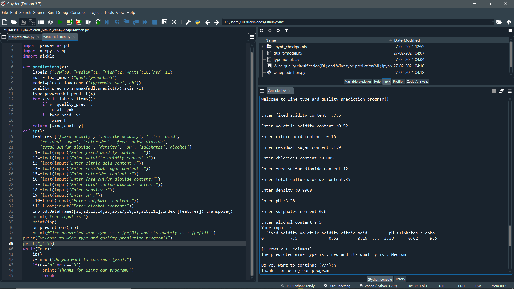

# Wine-quality-classification-DL-and-Wine-type-prediction-ML
Hello viewers this is my second project in deep learning and machine learning.
I wanted to kinda play with whatever I've learnt and this is the result.My ML model predicts wine type and my DL model predicts wine quality and 
I've combined the two into one using the code in the python script/notebook.
You can refer the notebook for full code or else simply download both the models and py script and run it on your pc.
Ps- Don't forget to download the dataset and also help me improve it by making necessary if needed.
A demo is shown below-

